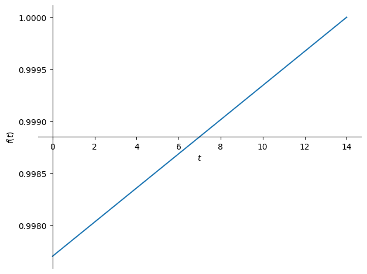
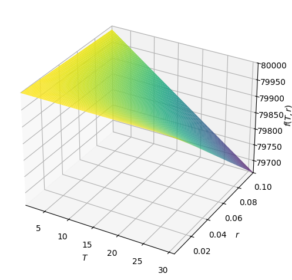

# Accrued Wage Interest

> "Accrued wages interest" refers to the interest that has accumulated on unpaid wages, essentially meaning the interest earned on the amount of money a company owes to its employees for work already performed but not yet paid out; it's considered an accrued expense in accounting, where the interest is recorded as a liability until the wages are paid... **In most cases, companies do not accrue interest on unpaid wages as the timeframe for payment is usually short** and interest charges are not typically applied to employee salaries — Google Gemini (emphasis mine)

So, accrued wage interest is too small to matter. But this is also a brilliant opportunity to leverage math and programming to critique capitalism.

## Problem Formulation

A worker labors over time to earn wages. However, employers holds the accruing wages throughout the pay period, only disbursing them at the end of the period in the form of a paycheck. Moreover, employers do not compensate workers for the opportunity cost of keeping those accrued wages as cash instead of a more profitable asset. In other words, *workers repeatedly make interest-free short-term loans to employers*.

We can formulate this as a discounted cash flow (DCF) problem, with the twist that the cash flows (wages) will be treated as continuous rather than discrete. (And the cash flows are theoretical. Lol.) Practically, we need:

1. An equation to discount a (differential) cash flow forwards to the next paycheck
1. A way to count up all the discounted cash flows over the course of a pay period
1. Assumptions about the typical discount rate and pay period length

## Solution

Long story short, the discount factor of accrued wage interest annually as a function of interest rate $r$, yearly earning rate $\alpha$, and pay period length $T$ is:

$$
\begin{equation}
V(r, \alpha, T) = \frac{365\alpha}{rT}(1-e^{-Tr/365})
\end{equation}
$$

Example: **if you earn $80,000 a year (net of taxes), paid every 14 days, and could instantly invest your continuously-earned wages at an interest rate of 6%, you could make a whopping $61!**

A mildly interesting corollary is that **your labor is worth slightly less at the beginning of a pay period than at the end**. This is due to the wages earned at the beginning of the period having a higher discount factor. Continuing with our example, we see at the time scale of a typical pay period the effect is virtually linear over the course of a pay period $t$:

And just for fun, we can also see the impact of the discount rate ($r$) and pay period interval ($T$) on the discount factor:

We see that, unsurprisingly, it gets worse for you as the discount rate goes up. The effect of longer pay intervals is just as bad.

See [derivation.ipynb](derivation.ipynb) for the full theory workup and plotting code.

## Takeaways

- Ha, this was fun!
- Try to work slightly less towards the start of your pay period than towards the end, due to the extra discounting factor. Lol.
- Negotiate with your boss to get paid more frequently? 🤷‍♀️
